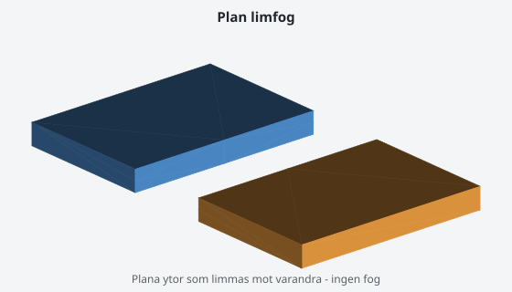
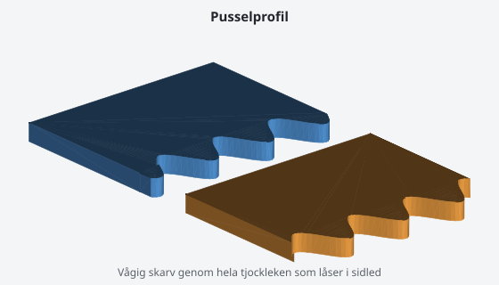
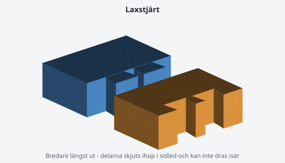
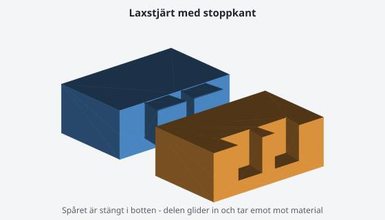
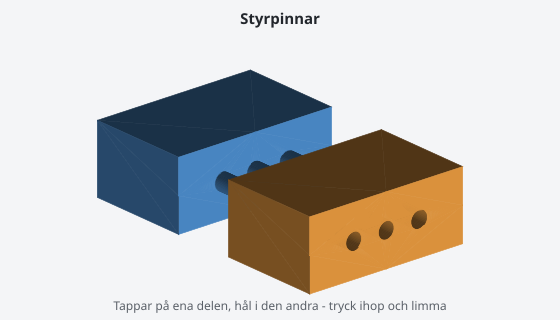
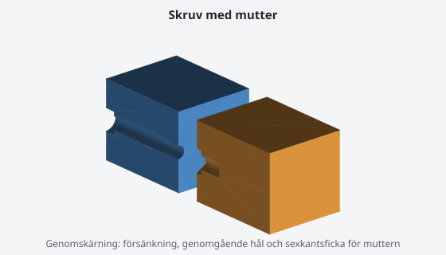

# Fogtyper

Programmet väljer fogtyp automatiskt utifrån hur snittytan ser ut, men du kan
alltid välja själv — i GUI:t med rullgardinsmenyn per snitt, på kommandoraden
med `--joint`. Den här sidan förklarar vad typerna är bra på.

Måttet som styr valet mest är **minsta väggtjocklek i snittet**: diametern på
den största cirkel som får plats inuti snittytan. En tunn platta har liten
väggtjocklek även om snittet är brett.

I bilderna nedan har den **blå** delen hanen och den **orange** delen honan.
Bilderna är renderade från den riktiga foggeometrin med
`python tools/render_joints.py`, så de visar exakt vad programmet bygger.
Samma bilder finns i det grafiska gränssnittet under knappen
*Fogtyper – vad är vad?*.

## Översikt

| Fogtyp | Passar när | Tas isär igen? | Rekommenderad tolerans |
|--------|-----------|----------------|------------------------|
| `none` | tjockleken är under 4 mm | nej | – (ytorna limmas) |
| `puzzle` | 4–8 mm och platt snitt | nej | 0,15 mm |
| `dovetail` | minst 8 mm och avlångt snitt | motvilligt | 0,15–0,20 mm |
| `dovetail` + stoppkant | samma, men delen ska ta emot i botten | nej | 0,15–0,20 mm |
| `pins` | minst 6 mm, gärna rundaktigt snitt | ja, men utan låsning | 0,10–0,15 mm |
| `screw` | minst 12 mm och du valt "ska kunna tas isär" | ja | 0,15 mm |

Toleransen (`clearance_mm`) är spelet mellan hane och hona, per sida. Den
kommer från skrivarprofilen: 0,15 mm för de flesta, 0,20 mm för Ender 3.

---

## `none` — plan limfog

Ingen geometri alls, bara en plan yta.

**När:** snittet är tunnare än 4 mm. Där får ingen fog plats utan att väggen
blir så tunn att den spricker.

**Montering:** limma. Cyanoakrylat (superlim) för PLA och PETG, eller
plastlim/aceton för ABS. Pressa ihop och håll kvar en stund.

**Tänk på:** en plan limfog har ingen styrning. Passa in delarna noga innan
limmet griper — det finns inget som håller dem på plats åt dig. Är snittytan
större än 5 000 mm² lägger programmet automatiskt till två styrpinnar som
hjälper till.

---

## `puzzle` — pusselprofil

En vågig skarv genom hela materialtjockleken, som en pusselbit. Två profiler
finns: `sine` (mjuk vågform, standard) och `keyhole` (rundade tappar med
undersnitt, låser hårdare).

**När:** platta detaljer, 4–8 mm tjocka. En laxstjärt eller pinne får inte plats
i tjockleken, men den vågiga skarven låser ändå delarna i sidled.

**Montering:** tryck ihop i planet och limma. Profilen ser till att delarna
hamnar rätt av sig själv.

**Tolerans:** 0,15 mm fungerar bra. Sitter det för hårt, höj till 0,2 mm — en
vågig skarv har mycket kontaktyta, så små fel märks.

**Tänk på:** pusselfogen kompletteras inte med styrpinnar. Den vågiga skarven
lämnar ingen plan yta att sätta dem i, och profilen styr redan delarna.

---

## `dovetail` — laxstjärt

Ett trapetsformat spår som är bredare längst ut än vid halsen (8° vinkel). Det
gör att delarna **inte** går att dra isär vinkelrätt mot skarven — bara skjutas
ihop i sidled.

**När:** tjocka, avlånga snitt från 8 mm och uppåt. Programmet lägger 1–3
laxstjärtar beroende på hur långt snittet är.

**Montering:** delarna skjuts ihop i sidled, inte rakt på. Ingångskanten har en
0,4 mm fas som gör det lättare att få igång. Limma om det ska sitta permanent —
laxstjärten låser mot dragkraft men inte mot att glida isär åt samma håll den
kom in.

**Tolerans:** 0,15 mm är utgångspunkten. Går det inte att skjuta ihop alls, höj
till 0,2–0,25 mm och skriv ut igen. Laxstjärten är den fogtyp som är känsligast
för passning, eftersom kontaktytan är sned.

**Tänk på:** skriv ut delarna så att laxstjärten inte hamnar i en riktning där
lagerlinjerna gör den svag. Ett spår som byggs liggande tål mer än ett som byggs
stående.

### Stoppkant i botten

Som standard går spåret rakt igenom: du skjuter in laxstjärten och den stannar
där friktionen tar. Kryssar du i **Stoppkant** i programmet stängs spårets bortre
ände, och laxstjärten görs lika mycket kortare. Då glider delen in och **tar emot
mot material** i stället för att bara hållas på plats av friktion.

Använd den när du vill att delarna ska hamna exakt rätt utan att du behöver mäta,
eller när fogen ska bära last i inskjutningsriktningen. Standardhöjden är 6 mm;
den kan aldrig ta mer än 40 % av inskjutningslängden, för då skulle fogen inte gå
att montera.

---

## `pins` — styrpinnar (dowels)

Cylindriska tappar med fasad topp på ena delen, hål med spel i den andra.
Diametern är 20 % av minsta väggtjocklek, som mest 8 mm. Hålet borras 0,3 mm
djupare än pinnen är lång, så att pinnen bottnar mot luft och delarna verkligen
möts yta mot yta.

**När:** tjocka snitt från 6 mm, särskilt runda eller kompakta där det inte
finns någon självklar glidriktning. Det här är också den fog programmet faller
tillbaka på när något annat inte får plats.

**Montering:** tryck ihop rakt på och limma. Pinnarna centrerar delarna men
håller dem inte ihop — limmet gör jobbet.

**Tolerans:** 0,10–0,15 mm. Pinnar är förlåtande; blir det för trångt kan du
fila lätt på pinnen i stället för att skriva ut om.

**Tänk på:** pinnarna placeras minst 3 mm in från snittytans kant, så att
väggen runt hålet inte spricker.

---

## `screw` — M3-skruv med mutter

Genomgående hål Ø3,4 mm och försänkning för skruvskallen i ena delen,
sexkantsficka för en M3-mutter (nyckelvidd 5,5 mm) vid snittytan i den andra.
Plus två styrpinnar som ser till att hålen möts.

**När:** du har valt "ska kunna tas isär" och snittet är minst 12 mm tjockt.
Det här är den enda fogen som är gjord för att öppnas igen.

**Montering:**
1. Lägg M3-muttern i sexkantsfickan. Den ska ligga i botten, med flatsidorna mot
   fickans väggar.
2. Sätt ihop delarna — styrpinnarna hittar rätt läge.
3. Skruva i M3-skruven från utsidan tills det tar emot.

Skruvlängd: räkna materialtjockleken genom del A plus 5–6 mm. En M3×20 räcker
för de flesta snitt.

**Tänk på:** muttern hålls på plats av att delarna sitter ihop. Innan du satt
ihop dem kan den ramla ur — vänd delen med fickan uppåt, eller sätt en droppe
lim under muttern om du vill vara säker.

---

## Om det inte passar

**För hårt.** Höj toleransen i GUI:t (fältet *Tolerans* under Montering) eller
`clearance_mm` i skrivarprofilen, och skriv ut igen. Ett steg om 0,05 mm i taget.

**För löst.** Sänk toleransen på samma sätt. Under 0,05 mm blir det oftast
omöjligt att montera.

**Det blev bara en fog på skarven, trots att modellen har flera väggar.**
Det var ett fel som är rättat — numera får varje vägg och mellanvägg som snittet
träffar en egen fog.

**"Bara N mm marginal till byggvolymen, så fogen får inte plats."** Delen fyller
nästan hela byggplattan, och en fog som sticker ut skulle göra den för stor.
Planeraren försöker lämna 12 mm luft till byggvolymens gräns, men på modeller
som nätt och jämnt går att dela räcker det inte alltid. Öka marginalen i
skrivarprofilen (steg 2 i programmet) så att delarna planeras mindre, eller välj
en skrivare med större byggvolym.

**Programmet valde en enklare fog än du bad om.** Meddelandet säger varför, med
mått: *"Snittet är bara 3.0 mm tjockt - för tunt för en laxstjärt."* Flytta
snittet dit materialet är tjockare, eller acceptera en limfog. Under 4 mm finns
det ingen fog som går att skriva ut.

Hela förklaringen finns i statusrutan och i `split_report.json`.

**Slicern säger "non-manifold edges".** Originalmodellen hade hål som inte gick
att laga, och delarna ärver dem. Se avsnittet Felsökning i README för hur du
lagar modellen på Linux, och kapa sedan om.

**Fogen sitter men delarna glappar.** Kontrollera att snittytorna är rena från
strängar och elefantfot innan du monterar. Ett par drag med en fil på första
lagret brukar räcka.
